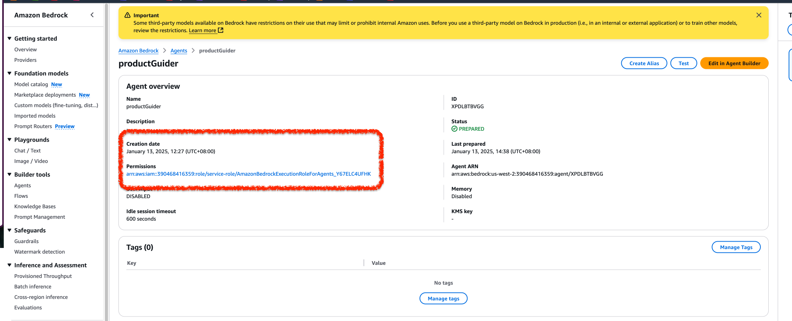

## Amazon Bedrock MultiAgent

## 支持Streaming吗？

支持， 但是注意需要设置


Agent的Role需要支持bedrock:InvokeModelWithResponseStream permission权限

```json
{
    "Version": "2012-10-17",
    "Statement": [
        {
            "Sid": "VisualEditor0",
            "Effect": "Allow",
            "Action": "bedrock:InvokeModelWithResponseStream",
            "Resource": "*"
        }
    ]
}

```