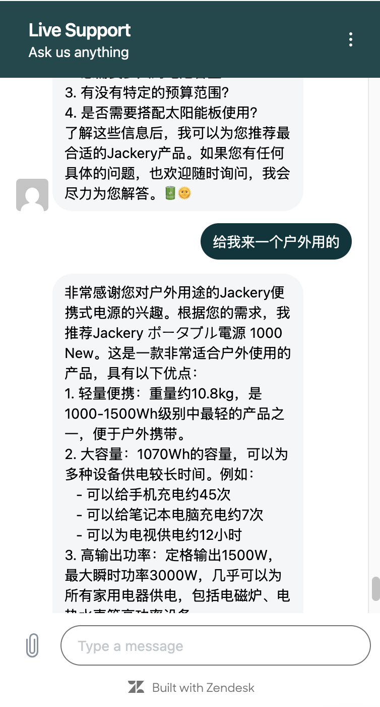

# Zendesk 智能客服机器人

基于[Zendesk Conversations API](https://developer.zendesk.com/documentation/conversations/getting-started/api-quickstart/)和Dify知识库的智能客服机器人系统。该系统可以自动回应客户询问，并通过Dify的知识库提供智能化的客服支持。

## API验证场景

本项目主要用于验证Zendesk Conversations API的功能和集成流程：

1. 消息接收：通过Webhook接收来自Zendesk Web Widget的客户消息
2. 自动回复：使用Conversations API发送自动回复消息
3. 会话管理：处理消息重试机制和会话状态维护
4. 知识库集成：结合Dify API提供智能化的回答

通过这个验证场景，我们可以了解：
- Zendesk Conversations API的基本工作流程
- Webhook的配置和消息处理方式
- 如何实现可靠的消息投递和重试机制
- 如何集成外部知识库来增强回复能力

## 在线体验

您可以通过以下链接体验智能客服机器人的功能：
[在线体验环境](https://d24grmpnk1tnqa.cloudfront.net/zdify.html)

### 效果展示



## 功能特点

- 集成Zendesk Messaging API实现自动回复
- 对接Dify知识库，提供智能问答能力
- 支持通过ngrok进行本地开发和测试
- 使用PM2进行生产环境部署和管理
- 完整的日志记录系统

## 环境要求

- Node.js (建议版本 >= 14)
- npm 包管理器
- ngrok (用于开发环境)
- PM2 (用于生产环境部署)

## 快速开始

### 1. 安装依赖

```bash
npm install
```

### 2. 环境配置

1. 复制环境变量模板文件：
```bash
cp .env.example .env
```

2. 配置以下环境变量：

```plaintext
# Dify API配置
DIFY_API_BASE_URL=https://dify.plaza.red/v1
DIFY_WORKFLOW_API_KEY=your_workflow_api_key_here
DIFY_AGENT_API_KEY=your_agent_api_key_here
DIFY_USER_ID=your_user_id_here

# Ngrok配置
NGROK_AUTHTOKEN=your_ngrok_auth_token_here
NGROK_DOMAIN=your_ngrok_domain_here

# Zendesk配置
ZENDESK_SUBDOMAIN=your_zendesk_subdomain
KEY_ID=your_key_id
KEY_SECRET=your_key_secret
```

### 3. Zendesk配置

1. 安装Zendesk Web Widget：
   - 访问 [Zendesk Web Widget安装指南](https://support.zendesk.com/hc/en-us/articles/4500748175258-Installing-the-Web-Widget-for-messaging)
   - 按照指南完成Widget的安装和基础配置

2. 配置Webhook：
   - 在Zendesk Admin Center创建webhook
   - 设置webhook endpoint为你的ngrok URL (例如：`https://your-domain.ngrok.io/messages`)
   - 创建并保存API密钥

### 4. 开发环境运行

```bash
# 使用nodemon启动开发服务器
npm run dev

# 或者使用普通模式启动
npm start
```

### 5. 生产环境部署

使用提供的部署脚本进行自动化部署：

```bash
chmod +x deploy.sh
./deploy.sh
```

部署脚本会自动：
- 安装所需依赖
- 安装并配置PM2
- 创建日志目录
- 启动应用程序
- 配置开机自启

## 日志管理

部署后可以通过以下命令查看各类日志：

```bash
# 查看应用状态
pm2 status

# 实时监控
pm2 monit

# 查看所有日志
pm2 logs zcis

# 查看控制台输出
tail -f ./logs/out.log

# 查看错误日志
tail -f ./logs/error.log

# 查看应用日志
tail -f ./logs/app.log
```

## 开发指南

### 项目结构

```
.
├── routes/          # 路由处理
├── services/        # 业务逻辑
├── ai_chatbot.js    # AI对话处理
├── DifyClient.js    # Dify API客户端
├── index.js         # 应用入口
└── deploy.sh        # 部署脚本
```

### 主要依赖

- express: Web服务器框架
- sunshine-conversations-client: Zendesk会话API客户端
- @ngrok/ngrok: 内网穿透工具
- axios: HTTP客户端
- dotenv: 环境变量管理
- nodemon: 开发环境热重载

## 许可证

MIT License

## 作者

yexw@amazon.com
